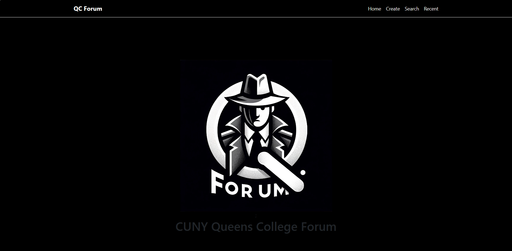
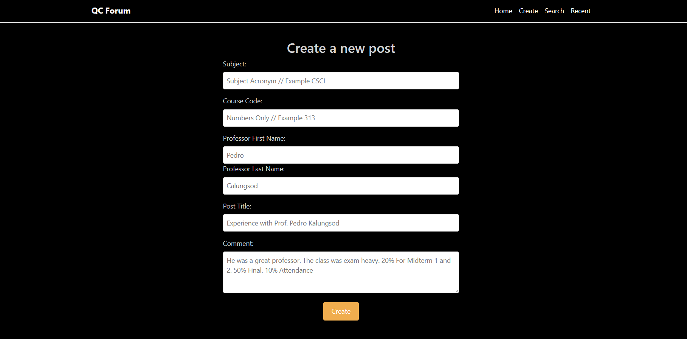
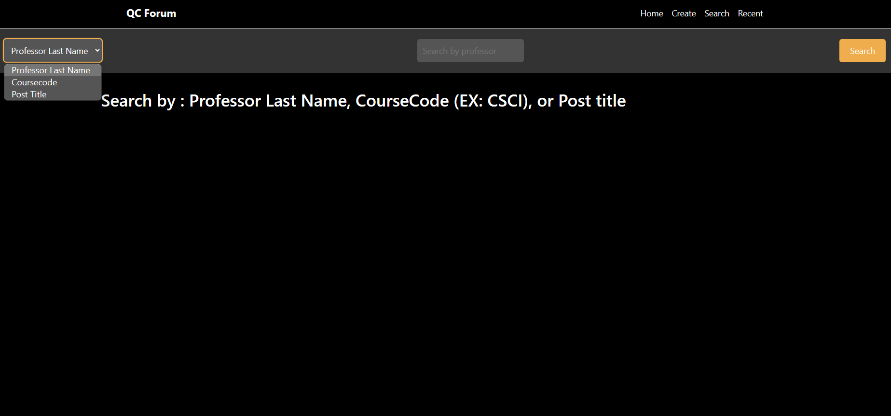
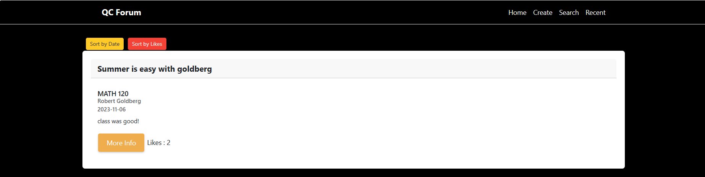
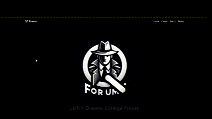

# Web Development Final Project - QC Forum

Submitted by: **Loyd Flores**

This web app: **Queens College Forum: Your Go-To Campus Insight Tool**

Welcome to the Queens College Forum, the dedicated digital hub for the Queens College student community! Designed with the spirit of transparency and student empowerment at its core, our platform revolutionizes the way you share and access honest feedback about courses and instructors.

# Discover the Difference: Anonymity with Impact

We understand the value of candid communication—especially when it comes to your educational experience. That's why we've built an environment where your voice can be heard, loud and clear, without the hesitation that comes with identity disclosure. Share your classroom experiences, give constructive criticism, or praise the pedagogical prowess of your professors—all while maintaining your anonymity.

# Simplicity Meets Efficacy

Our intuitive interface ensures that your journey from logging in to leaving a review is seamless. Whether you're on the go or between classes, providing your valuable insights is just a few taps away.

Features Tailored for the Queens College Student:

- 🗸 Create with Ease: Post your reviews effortlessly with our straightforward submission form.
- 🗸 Rich Posts: Craft your message with a blend of text, titles, and visuals to fully express your classroom experiences.
- 🗸 Live Feed: Stay updated with real-time posts from fellow students, displaying the latest insights on your home screen.
- 🗸 Engaging Metrics: Gauge the pulse of your campus with post details such as creation time, title popularity, and upvote counts.
- 🗸 Focused Browsing: Jump straight to the content that matters to you by sorting posts by recency or upvotes and searching by title.
- 🗸 Dedicated Post Pages: Delve deeper into discussions with separate pages for each post, enriched with extended content and community comments.
- 🗸 Interactive Engagement: Participate in shaping campus opinion with comments and unlimited upvotes on post pages.
- 🗸 Content Control: Reflect upon your feedback? You have the power to edit or remove your posts, ensuring that your digital footprint aligns with your current views.

Time spent: **24** hours spent in total

## Required Features

The following **required** functionality is completed:

- [🗸] **A create form that allows the user to create posts**
- [🗸] **Posts have a title and optionally additional textual content and/or an image added as an external image URL**
- [🗸] **A home feed displaying previously created posts**
- [🗸] **By default, the time created, title, and number of upvotes for each post is shown on the feed**
- [🗸] **Clicking on a post shall direct the user to a new page for the selected post**
- [🗸] **Users can sort posts by either their created time or upvotes count**
- [🗸] **Users can search for posts by title**
- [🗸] **A separate post page for each created post, where any additional information is shown is linked whenever a user clicks a post**
- [🗸] **Users can leave comments underneath a post on the post's separate page**
- [🗸] **Each post should have an upvote button on the post's page. Each click increases its upvotes count by one and users can upvote any number of times**
- [🗸] **A previously created post can be edited or deleted from its post page**

The following **optional** features are implemented:

- [ ] Users can only edit and deleted posts or delete comments by entering the secret key, which is set by the user during post creation
- [ ] Upon launching the web app, the user is assigned a random user ID. It will be associated with all posts and comments that they make and displayed on them.
- [ ] Users can repost a previous post by referencing its post ID. On the post page of the new post, the referenced post is displayed and linked, creating a thread
- [ ] Users can customize the interface of the web app
- [ ] Users can share and view web videos
- [ ] Users can set flags while creating a post. Then users can filter posts by flags on the home feed.
- [ ] Users can upload images directly from their local machine as an image file
- [🗸] Display a loading animation whenever data is being fetched

The following **additional** features are implemented:

- [🗸] Styled with bootstrap
- [🗸] Mobile Responsive
- [🗸] Relational Database that connects post and comments
- [🗸] Automatic form formatting and validation. Subject auto all caps, coursecode only numbers, Auto capitalize first letter for name.

## Photo Snippets

## Video Walkthrough

Here's the full walkthrough link:
[Watch the Video](https://clipchamp.com/watch/8JzsMFOy2aL)

<!-- Replace this with whatever GIF tool you used! -->

GIF created with ...

Microsoft Clipchamp

## Notes

Describe any challenges encountered while building the app.

## License

    Copyright 2023 Loyd Flores

    Licensed under the Apache License, Version 2.0 (the "License");
    you may not use this file except in compliance with the License.
    You may obtain a copy of the License at

        http://www.apache.org/licenses/LICENSE-2.0

    Unless required by applicable law or agreed to in writing, software
    distributed under the License is distributed on an "AS IS" BASIS,
    WITHOUT WARRANTIES OR CONDITIONS OF ANY KIND, either express or implied.
    See the License for the specific language governing permissions and
    limitations under the License.
